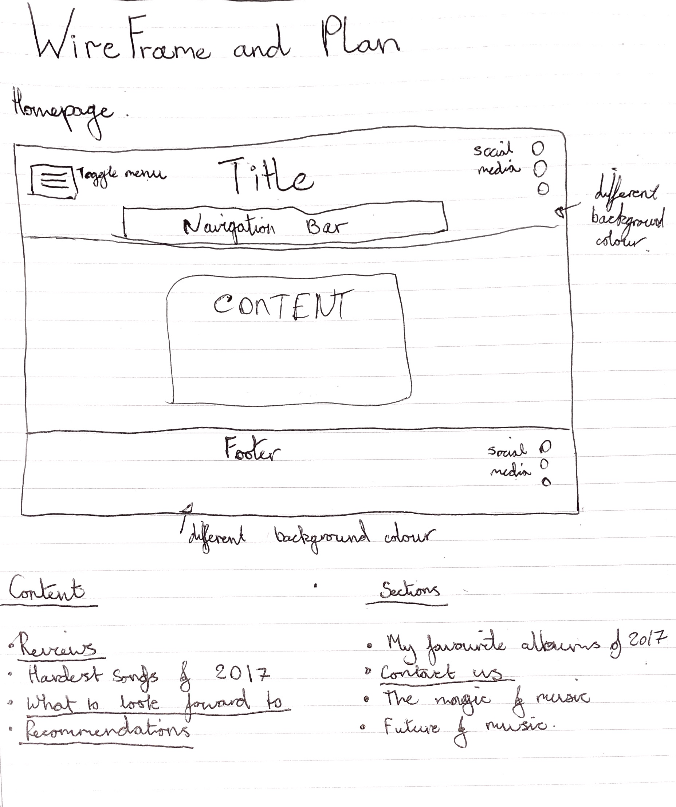

<h1>Read Me File</h1>

	

	During the development of my website many problems and errors occurred. 
	The major error in which I had first encountered was with my navigation bar. 
	Making this a viable and efficient method of navigation through my website was a tall order for me, 
	as when I tried to fix one problem another would arise. I overcame this with the help of my peers and tutors in labs.
	

	

	One of the most effective elements that I put in use whilst creating my website was wireframes.
	They were extremely useful for me as they gave me a basic idea of how i wanted my website to look,
	making it much easier to create and develop. I created a wireframe before i started the deveopment of each page of my website.
	As a result of this, the wireframes do not resemble my finished project precisely because development took longer than expected 
	as the pages themselves went through many iterations before reaching completion.
	

<h2>Homepage Wireframe</h2>

<h2>Wireframe for majority of content pages and the Wireframe for the Contact Us page</h2>

<h2> Testing </h2>

	

	The testing of this website was conducted in many different ways, imidiate testing was conducted by myself. This was done by simply using the website
	testing to see that all the links worked properly, images displayed and the site was responsive. The second and possibly the most valuable test 
	I conducted on the webiste, was running it throught the <a href="https://validator.w3.org/">W3C Validator</a>. I ran my HTML code and CSS code through this 
	validator to make sure there was no errors, but if any arose I would debug the issue and attempt to solve it. The W3C Validator was very helpful in this process: 
	showing the amount of errors I had accumalted, where they were in the code and why they may have emerged.
	

<h2> Problems Encountered </h2>

	

	Whilst resizing my web page i noticed that the my title witin the h1 tag was spilling out of the boundaries of the header in very minimal sizes. I was unable to find a 
	solution to this problem. I did not think this was a major problem as this design error was only encountered when the width of the window was below 389px, which is an extremely small
	 window size. I believe that this should not be encountered during use from any user in mobile view port. Many debugging issues were encountered whilst developing this 
	 website from little to small from forgetting to close tags to complications with positioning. These positioning errors were easily corrected with the use 
	 of flex box.
	

<h2> References </h2>

	

	Used lab 07
	W3C Schools for a lot
	Sourced many images from genius
	https://developers.google.com/maps/documentation/javascript/adding-a-google-map#get_latLng
	
	

